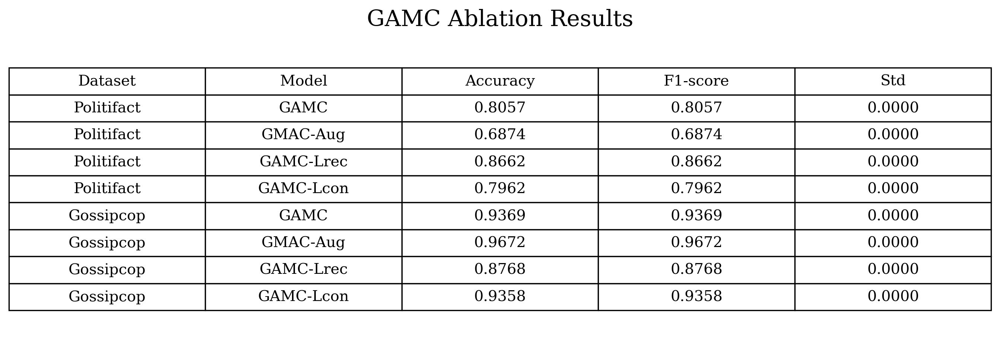
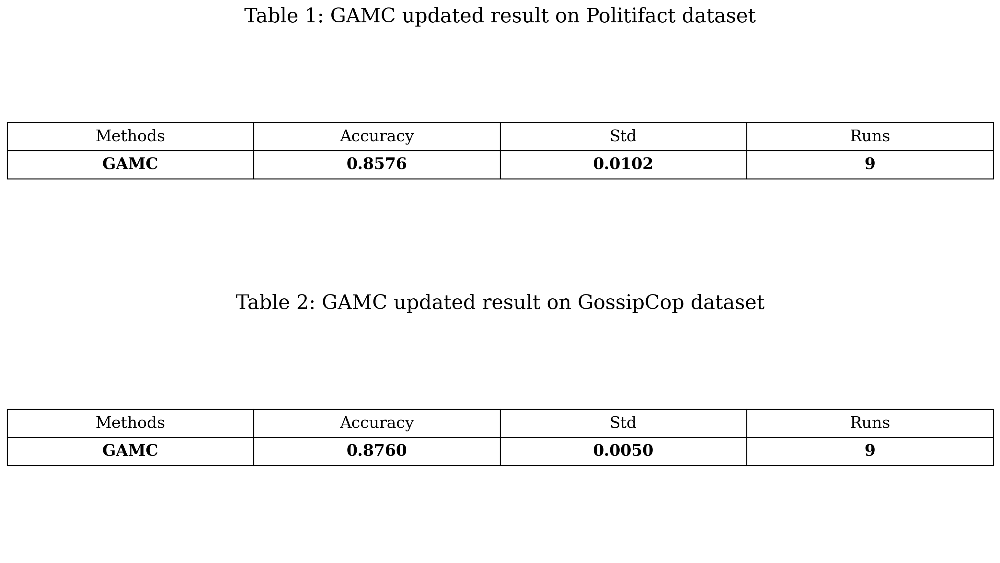
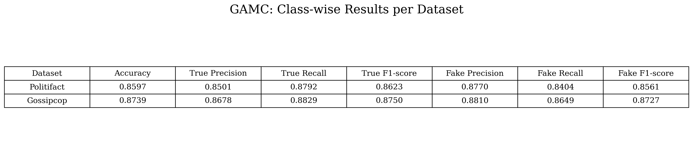
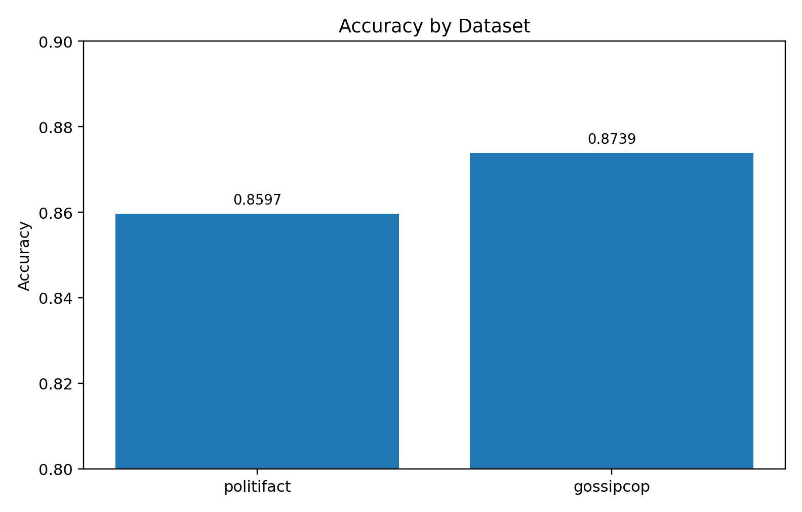
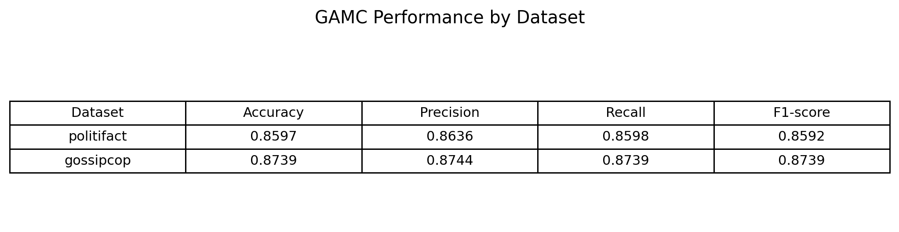

# GAMC Study Replication (FakeNewsNet)

This repository reproduces GAMC for unsupervised fake news detection with graph masking and reconstruction.

## Study Replication

This study replicates GAMC on FakeNewsNet and reports controlled ablation results.

## Replicated Study Citation

Yin, S., Zhu, P., Wu, L., Gao, C., and Wang, Z. (2024). GAMC: An unsupervised method for fake news detection using graph autoencoder with masking. Proceedings of the AAAI Conference on Artificial Intelligence, 38(1), 347-355.

BibTeX:

```bibtex
@inproceedings{yin2024gamc,
  title={Gamc: an unsupervised method for fake news detection using graph autoencoder with masking},
  author={Yin, Shu and Zhu, Peican and Wu, Lianwei and Gao, Chao and Wang, Zhen},
  booktitle={Proceedings of the AAAI conference on artificial intelligence},
  volume={38},
  number={1},
  pages={347--355},
  year={2024}
}
```

## Dataset

- Download datasets from:
  https://drive.google.com/drive/folders/1OslTX91kLEYIi2WBnwuFtXsVz5SS_XeR?usp=sharing
- Datasets used in this study:
  - politifact
  - gossipcop
- Feature setting:
  - bert

Place files in the expected layout, for example: `GAMC/code/data/<dataset>/raw` and `GAMC/code/data/<dataset>/processed`.

## Step-by-Step Methodology (Unsupervised FND Process)

1. Build graph inputs for fake news detection.
  - Load Politifact and GossipCop graphs with bert node features.
  - Create graph objects with edge structure and graph-level metadata.
  - Cache processed tensors for repeatable runs.

2. Configure the unsupervised encoder-decoder pipeline.
  - Select GAMC with masking and graph reconstruction.
  - Enable contrastive views for representation consistency.
  - Load tuned dataset settings with `--use_cfg`.

3. Run label-free representation learning.
  - Train on graph structure and node features without supervised classification loss.
  - Optimize reconstruction and contrastive objectives according to the selected ablation mode.
  - Save the trained encoder checkpoint.

4. Extract graph-level embeddings.
  - Pass each graph through the trained encoder.
  - Apply graph pooling to obtain one embedding vector per graph.

5. Evaluate embeddings with a lightweight classifier.
  - Train an SVM on extracted embeddings.
  - Use stratified cross-validation for robust metrics.
  - Report Accuracy and Micro-F1.

6. Quantify component contribution with ablations.
  - Run four settings with identical runtime controls:
    - full
    - gmac_aug
    - gamc_lrec
    - gamc_lcon
  - Keep backend, seed policy, and config source fixed across variants.

7. Aggregate and publish results.
  - Save per-variant CSVs for each dataset.
  - Generate consolidated summary tables and figure artifacts.
  - Compare final metrics across full GAMC and all ablations.

Notes:
- `--use_cfg` loads tuned dataset-specific settings from `configs.yml`.
- In this workflow, unsupervised training runs before SVM evaluation.
- For apples-to-apples comparison, keep backend, seed count, and other runtime flags fixed across ablation variants.

## Run Instructions

Run from `GAMC/code`.

### 1) Single GAMC run

```bash
python main_new.py --dataset politifact --feature bert --use_cfg --gpu_backend cpu --device -1 --save_model
```

### 2) 1-seed ablation study (apples-to-apples)

```bash
python main_new.py --dataset politifact --feature bert --ablation full      --seeds 0 --use_cfg --gpu_backend cpu --device -1 --save_model
python main_new.py --dataset politifact --feature bert --ablation gmac_aug  --seeds 0 --use_cfg --gpu_backend cpu --device -1 --save_model
python main_new.py --dataset politifact --feature bert --ablation gamc_lrec --seeds 0 --use_cfg --gpu_backend cpu --device -1 --save_model
python main_new.py --dataset politifact --feature bert --ablation gamc_lcon --seeds 0 --use_cfg --gpu_backend cpu --device -1 --save_model

python main_new.py --dataset gossipcop --feature bert --ablation full      --seeds 0 --use_cfg --gpu_backend cpu --device -1 --save_model
python main_new.py --dataset gossipcop --feature bert --ablation gmac_aug  --seeds 0 --use_cfg --gpu_backend cpu --device -1 --save_model
python main_new.py --dataset gossipcop --feature bert --ablation gamc_lrec --seeds 0 --use_cfg --gpu_backend cpu --device -1 --save_model
python main_new.py --dataset gossipcop --feature bert --ablation gamc_lcon --seeds 0 --use_cfg --gpu_backend cpu --device -1 --save_model
```

### 3) Build ablation summaries

```bash
python results/generate_ablation_summary.py
python results/generate_ablation_table_figure.py
```

## Generated Outputs

The pipeline writes outputs to `GAMC/code/results` and `GAMC/code/checkpoints`:

- Per-configuration ablation CSVs:
  - `ablation_politifact_full.csv`
  - `ablation_politifact_gmac_aug.csv`
  - `ablation_politifact_gamc_lrec.csv`
  - `ablation_politifact_gamc_lcon.csv`
  - `ablation_gossipcop_full.csv`
  - `ablation_gossipcop_gmac_aug.csv`
  - `ablation_gossipcop_gamc_lrec.csv`
  - `ablation_gossipcop_gamc_lcon.csv`
- Consolidated summary files:
  - `ablation_summary.csv`
  - `ablation_summary.md`
  - `ablation_summary_table.md`
  - `ablation_summary_table.png`
- Model checkpoints:
  - `checkpoints/checkpoint_<dataset>_<ablation>_seed<seed>.pt`

## Output Figures

These figures are generated in `GAMC/code/results`.

### Ablation Summary Table



### GAMC-Only Results Table



### Classwise Results Table



### Final Results Table


### Final Accuracy Bar Plot



### Seed Stability Boxplot



## Dependencies

- Python >= 3.7
- PyTorch >= 1.9.0
- DGL >= 0.7.2
- pyyaml == 5.4.1


